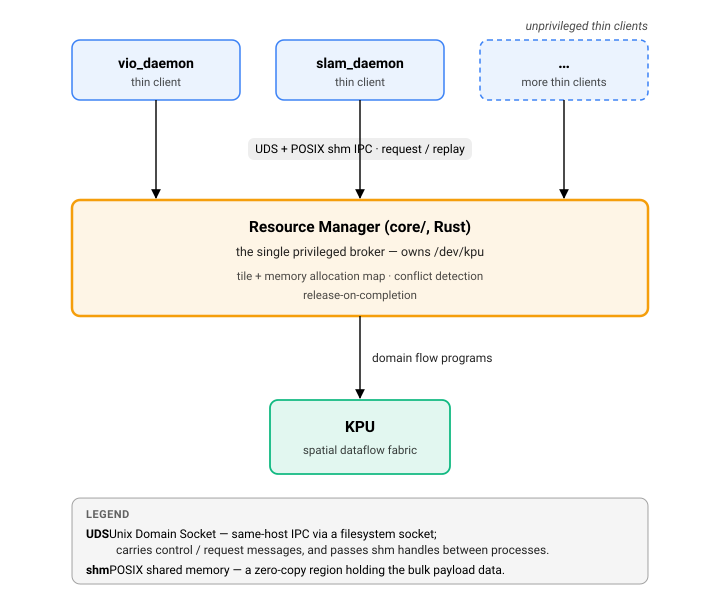

# ADR 0008 — Host Broker + Thin Client runtime topology

**Status:** Accepted
**Date:** 2026-05-20
**Source:** `docs/arch/cortex-repo.md`, *The "Host Broker + Thin Client" Topology*
**Related:** [ADR-0004](0004-rm-allocates-dfa-compiler-schedules.md), [ADR-0009](0009-crash-only-rm-recovery.md); issue #21

## Context

Several operator processes (VIO, SLAM, segmentation, …) need the KPU at
the same time. Because allocation on the KPU is tied to each operator's
spacetime footprint (ADR-0004), letting processes open the driver
independently would let them corrupt each other's allocations.

## Decision

- **Exactly one Resource Manager** (Rust, `core/`) runs as a privileged
  host service (e.g. `systemd`). It is the **only** process with access to
  `/dev/kpu` and the physical DMA memory pools, and it holds the global
  allocation map.
- **Operator processes are unprivileged thin clients.** They request
  execution over a **Unix domain socket plus POSIX shared memory** IPC
  channel and get zero-copy shared-memory results back. The SDK wraps those
  buffers as `std::span` and never sees the hardware.

Request flow: client asks to run a domain flow program → RM checks its
allocation map and either places it spatially beside other work or holds it
until the fabric frees → RM configures DMA and triggers the KPU → RM hands
the shared-memory result back.

## Consequences

- Never give an SDK consumer or daemon direct hardware access, and never
  add a code path that opens `/dev/kpu` outside `core/`.
- The RM sees every in-flight request, so it can enforce dependencies (hold
  SLAM until VIO's allocation is released) and avoid conflicts globally.
- The RM is a single point of failure. ADR-0009 makes it cheap to restart.
- **Current state:** the SITL memory provider emulates the hardware with
  POSIX shared memory; the IPC broker is issue #21.
