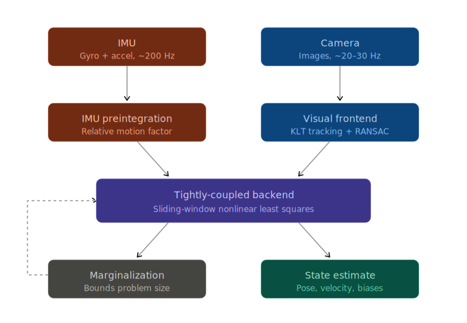
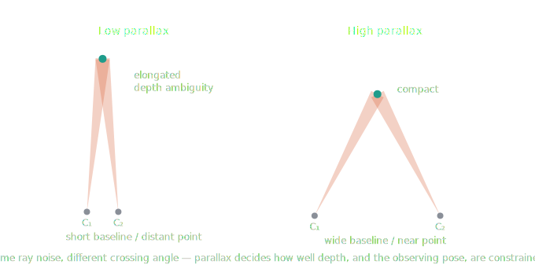

# Visual Inertial Odometry

Visual-Inertial Odometry is one of the harder things in robotics perception, so I'll give you a real mental model rather than a tutorial-shaped wrapper around a GitHub repo. Let me lay out the architecture first, then walk the components, then the parts that actually break, then a concrete build path.

## The core idea: why fuse at all

A camera and an IMU are complementary in almost exactly the right way. A camera gives you rich geometric structure but at ~20–30 Hz, suffers under motion blur and low texture, and — if monocular — is **scale-ambiguous** (you can't tell a small scene close up from a large scene far away). An IMU gives you angular velocity and specific force at 100–1000 Hz, is immune to texture, and crucially senses **gravity**, which fixes metric scale and two rotational DoF (roll/pitch). But integrate an IMU alone and it drifts catastrophically within seconds because you're double-integrating biased, noisy acceleration.

Fusing them: the IMU carries you through fast motion and texture-poor stretches and resolves monocular scale; the camera corrects IMU drift whenever structure is visible. The result is a system that is locally metric and accurate. Note the word *odometry* — VIO drifts globally over long trajectories. Adding loop closure is what turns it into SLAM.

There are two axes of design choice you must understand before anything else:

**Loosely vs. tightly coupled.** Loosely coupled runs a vision pipeline and an IMU pipeline separately and fuses their outputs. Tightly coupled jointly estimates everything from raw measurements (pixel reprojection residuals + IMU residuals in one estimator). Tightly coupled is strictly more accurate and is what every serious system uses; loosely coupled is mostly a historical/embedded compromise.

**Filtering vs. smoothing (optimization).** This is the real fork:

## The pipeline

Here's the data flow of a tightly-coupled, optimization-based VIO system (the dominant modern design — VINS-Mono, OKVIS, Basalt all look like this):

The dashed line is the part people underestimate: marginalizing old states out of the window produces a Gaussian prior that feeds back in, and getting that prior wrong is the most common source of subtle drift and inconsistency.

## The sensors and their error models

Get the measurement models right or nothing downstream works.

The **IMU** is the part most software engineers underrespect. The accelerometer measures *specific force* — true acceleration minus gravity, expressed in the sensor frame — not acceleration. The gyroscope measures angular velocity. Both are corrupted by additive white noise *and* a slowly-varying **bias** that follows a random walk. So your measurement model is `measured = true + bias + white_noise`, with the bias itself being a state you must estimate online, not a constant. You characterize the four noise parameters (gyro/accel white noise density and bias random-walk density) from a static Allan-variance analysis of your specific IMU; using a manufacturer datasheet number is a reliable way to get a poorly-tuned estimator.

The **camera** model is the standard pinhole projection plus a distortion model (radial-tangential for normal lenses, equidistant/Kannala-Brandt for fisheye). The detail that destroys naive implementations is **rolling shutter**: most cheap CMOS sensors expose rows sequentially over ~20–30 ms, so under motion every row has a different pose. You either use global-shutter hardware (the correct answer for a first system) or you model the per-row time offset explicitly. Don't pretend it isn't there.

## Calibration and time sync — the unglamorous prerequisite

Two things will silently wreck accuracy before any algorithm runs. First, the **camera-IMU extrinsic** (the rigid transform between the two frames) and the camera intrinsics — you estimate these offline with Kalibr. Second, **temporal alignment**: the camera and IMU clocks are rarely synchronized, and a constant time offset of even a few milliseconds maps directly into pose error during fast motion. Either hardware-trigger the camera off the IMU clock, or estimate the time offset as a state (VINS-Mono does this online). Budget real time for calibration; a beautifully coded estimator on badly-calibrated data is worthless.

## IMU preintegration — the key idea that makes optimization tractable

Naively, between two camera frames you'd integrate the IMU equations forward from the start pose/velocity to get a motion constraint. The problem: in an iterative optimizer the start pose/velocity *changes every iteration*, so you'd have to re-integrate hundreds of raw IMU samples each time. **Preintegration** (Lupton & Sukkarieh, then Forster et al., *On-Manifold Preintegration*, TRO 2017) reformulates the integration into relative quantities — a delta-rotation, delta-velocity, and delta-position — that are independent of the absolute starting state, computed once. Because rotation lives on `SO(3)`, this is done on-manifold. The only remaining dependency is on the bias, handled with a first-order Jacobian correction so a bias update doesn't force re-integration. The output is a single relative-motion factor with a properly propagated covariance connecting two keyframes. This is the standard inertial residual in every modern optimization-based VIO, and GTSAM ships it as `CombinedImuFactor`. Understand this paper before writing any backend code.

## The frontend

This is the part that resembles ordinary computer vision. Two schools: **indirect/feature-based** methods detect points (FAST/Shi-Tomasi corners), track them frame-to-frame with KLT optical flow or match descriptors, reject outliers with RANSAC on the epipolar/fundamental constraint, and feed 2D observations to the backend. **Direct methods** (used by ROVIO, DSO-style systems) skip features and minimize photometric error on image patches directly, which is more robust in low-texture scenes but more sensitive to photometric calibration and large motions. For a first system, build a KLT-based indirect frontend; it's the most forgiving to debug because you can visualize tracked features and immediately see when tracking falls apart.

## The backend: filter vs. smoother

This is the genuine architectural fork, and you should pick deliberately rather than by fashion.

**Filtering — the MSCKF.** The Multi-State Constraint Kalman Filter (Mourikis & Roumeliotis, 2007) is the clever filter design. Instead of putting 3D landmarks in the EKF state (which would make state size grow with the map and blow up the covariance update), it keeps a *sliding window of recent camera poses* in the state. When a feature is finally lost, it's triangulated and its reprojection residuals are projected onto the null space of the feature Jacobian — algebraically marginalizing the landmark while still imposing a multi-view constraint across all the poses that saw it. The result is bounded computation regardless of map size, which is why MSCKF-style systems (OpenVINS, the older MSCKF-VIO) remain attractive on compute-constrained platforms.

**Smoothing — sliding-window optimization.** Here you solve a nonlinear least-squares problem over a window of recent keyframe states, with reprojection residuals and preintegrated IMU residuals as factors (VINS-Mono, OKVIS, Basalt, ORB-SLAM3's inertial mode). This is more accurate than filtering because it *relinearizes* at each iteration rather than committing to a single linearization, at higher computational cost. With modern hardware the accuracy advantage usually wins, which is why most current systems are smoothers. Incremental smoothing (GTSAM's iSAM2) recovers much of the lost efficiency by only re-solving the parts of the factor graph that change.

The honest summary: filters trade accuracy for compute and were historically favored for embedded; smoothers are now the default unless you're severely compute-limited.

## The three things that actually break

**State representation on manifolds.** Orientation is not a vector. You cannot stuff Euler angles into your state and run gradient descent — you'll hit gimbal lock and the optimizer will misbehave near singularities. Rotations live on `SO(3)`, poses on `SE(3)`, and you optimize using the Lie-algebra tangent space (the `exp`/`log` maps), with retraction back onto the manifold after each update. Use Sophus for the group operations and let Ceres (via its `Manifold`/local-parameterization machinery) or GTSAM handle the on-manifold update. This is non-negotiable and a frequent source of bugs in homegrown implementations.

**Initialization.** Monocular VIO must bootstrap scale, gravity direction, initial velocity, and IMU biases before the main estimator can run, and it must do so from a short, possibly poorly-excited motion segment. The standard recipe (VINS-Mono) is a vision-only structure-from-motion solution up to scale, then a visual-inertial alignment that recovers the metric scale, gravity, velocity, and gyro bias by matching the SfM motion to the preintegrated IMU. If the motion lacks sufficient acceleration excitation, scale is weakly observable and initialization fails or converges to garbage. This is one of the top real-world failure modes.

**Observability and consistency.** VIO has exactly **four unobservable directions**: global 3D position and rotation about the gravity vector (yaw). Roll and pitch *are* observable because the accelerometer senses gravity. The danger is that a standard EKF, by linearizing different residuals at inconsistent state estimates, can spuriously gain "information" along the unobservable yaw direction — making the filter overconfident and inconsistent, which manifests as drift the covariance claims shouldn't exist. The fix is **First-Estimate Jacobians** (Huang/Mourikis/Roumeliotis): evaluate the Jacobians at fixed first estimates of each state so the estimator's observability properties match the true system's. Optimization-based systems face the analogous issue through their marginalization prior. If you skip this, your system will work on EuRoC and then drift mysteriously in deployment.

## Odometry vs. SLAM

Everything above is *odometry* — locally accurate, globally drifting. To bound global drift you add a place-recognition module (DBoW2 bag-of-words is the standard) to detect loop closures, then run a pose-graph optimization to redistribute the accumulated error. VINS-Mono does this as a separate 4-DoF pose graph (the 4 corresponding to the observable/unobservable split). Decide early whether you're building VIO or full VI-SLAM; the loop-closure subsystem is largely independent of the odometry core and can be added later.

## A realistic build path

A critical word first: do not write your own nonlinear least-squares solver or Lie-group library for this. The educational return is real but it's a *different* project, and Ceres/GTSAM/Sophus are battle-tested in ways your weekend code won't be. Spend your effort on the VIO-specific logic.

The C++ toolchain: Eigen for linear algebra, Sophus for `SO(3)`/`SE(3)`, OpenCV for image processing and KLT, OpenGV for geometric relative-pose solvers, and then either **GTSAM** (factor graphs, iSAM2, built-in `CombinedImuFactor` — the fastest path to a working smoother) or **Ceres** (general NLS, what VINS-Mono uses). For calibration: Kalibr offline plus an Allan-variance tool for IMU noise. For data and evaluation: the **EuRoC MAV** dataset is the canonical VIO benchmark (stereo + synced IMU + millimeter ground truth), TUM-VI for fisheye, and the `evo` package for computing ATE/RPE — remember to align monocular trajectories with a 7-DoF Sim(3) transform and metric trajectories with 6-DoF SE(3).

A sane sequence: (1) read Forster's preintegration paper, the MSCKF paper, the VINS-Mono paper, and Barfoot's *State Estimation for Robotics* (free PDF — the manifold and EKF foundations); (2) clone and *run* one reference system on EuRoC to establish what "working" looks like — OpenVINS is the best-documented filter-based one, VINS-Fusion the canonical smoother; (3) implement components in isolation against ground truth: first a KLT feature tracker, then IMU preintegration as a GTSAM factor (validate the propagated covariance against integrated raw IMU), then a two-frame visual-inertial alignment, then the sliding window; (4) only then assemble and benchmark with `evo`.

Set expectations honestly: a from-scratch VIO that's competitive on EuRoC is a multi-month effort even for an experienced developer, and most of the difficulty is in calibration, initialization, and consistency — not the parts that look hard in the papers.

One caveat on currency: learning-based and hybrid VIO (deep feature frontends, learned IMU denoising, end-to-end approaches) has been an active research direction, and if you care about the current state of the art beyond the classical pipeline above, that's worth a literature search rather than relying on what I've described, which is the established classical foundation.

Where do you want to go deeper — the math of one component, the GTSAM vs. Ceres tradeoff for your target platform, or the calibration workflow?

## IMU measurement model and noise characteristics in VIO

The IMU model is where careful engineers separate from the ones whose system "works on EuRoC and drifts in the field." Let me give you the model, then the noise structure, then the parts that actually bite.

## The measurement model

A strapdown 6-axis IMU gives you two vector measurements at high rate. The gyroscope measures angular velocity of the body frame in the body frame; the accelerometer measures **specific force** — proper acceleration, *not* coordinate acceleration. This distinction is the single most important thing in the whole model. A stationary IMU reads roughly $+9.81\,\text{m/s}^2$ along its up axis (it senses the normal force resisting gravity), not zero. If your code expects a static IMU to read zero acceleration, your gravity alignment is already broken.

The standard VIO measurement model (Forster et al. notation) is:

$$\tilde{\boldsymbol{\omega}}_b = \boldsymbol{\omega}_b + \mathbf{b}_g + \mathbf{n}_g$$

$$\tilde{\mathbf{a}}_b = \mathbf{R}_{wb}^\top\,(\mathbf{a}_w - \mathbf{g}_w) + \mathbf{b}_a + \mathbf{n}_a$$

The tilde is the measurement, $\mathbf{b}$ is the bias, $\mathbf{n}$ is white noise, $\mathbf{R}_{wb}$ rotates body to world. Read the accelerometer equation carefully: the sensor reports $\mathbf{R}_{wb}^\top(\mathbf{a}_w - \mathbf{g}_w)$, so to recover world acceleration you must invert orientation *and add gravity back*:

$$\mathbf{a}_w = \mathbf{R}_{wb}(\tilde{\mathbf{a}}_b - \mathbf{b}_a - \mathbf{n}_a) + \mathbf{g}_w$$

Two consequences fall out immediately. First, **orientation error leaks directly into position** through that gravity subtraction — a tiny attitude tilt rotates a ~$9.81\,\text{m/s}^2$ gravity vector into your horizontal axes, and double-integrating that error is brutal. Second, gravity must be known: its direction is estimated at initialization, and its magnitude is location-dependent (≈9.78–9.83 depending on latitude/altitude), so a hardcoded 9.81 with the wrong sign convention is a classic init failure. Pin down your gravity sign and frame convention before anything else.

## The bias is a state, not a calibration constant

The biases drift — slowly, with temperature, between power cycles — so they are modeled as random walks driven by white noise and **estimated online** as part of the VIO state:

$$\dot{\mathbf{b}}_g = \mathbf{n}_{bg}, \qquad \dot{\mathbf{b}}_a = \mathbf{n}_{ba}$$

This is the random-walk approximation of what is physically a flicker-noise (1/f) process. It's not exact, but it's tractable in a Kalman/factor-graph framework, which is why everyone uses it. The camera observations are what make the biases observable at all. A critical asymmetry: **gyro bias is well-observed, accelerometer bias is weakly observed**, because a constant accel bias is nearly indistinguishable from a small attitude tilt (both push gravity into the horizontal axes). Accel bias typically converges slowly and noisily, and badly-excited motion can leave it essentially unidentified. Don't be surprised when it's the flakiest part of your state vector.

## The two noise types and their units

There are exactly two stochastic terms per sensor, and they're physically different:

The **white measurement noise** ($\mathbf{n}_g$, $\mathbf{n}_a$) is broadband, zero-mean, modeled as continuous-time white Gaussian with a power spectral density. Integrated once, gyro white noise produces a random walk in *angle* (Angle Random Walk, units $\text{rad/s}/\sqrt{\text{Hz}}$) and accel white noise produces a random walk in *velocity* (Velocity Random Walk, $\text{m/s}^2/\sqrt{\text{Hz}}$).

The **bias random walk** ($\mathbf{n}_{bg}$, $\mathbf{n}_{ba}$) is the white noise driving the bias evolution above, with densities in $\text{rad/s}^2/\sqrt{\text{Hz}}$ (gyro) and $\text{m/s}^3/\sqrt{\text{Hz}}$ (accel).

Those four numbers — gyro noise density, gyro bias random walk, accel noise density, accel bias random walk — are exactly the four fields in a Kalibr-style IMU yaml, and they are the only IMU stochastic parameters a standard VIO consumes.

## Reading them off: Allan deviation

You characterize those four parameters with an Allan-variance analysis: log several hours of a stationary IMU, compute the Allan deviation $\sigma(\tau)$ over averaging window $\tau$, and read the regimes off the log-log plot.

The descending $-\tfrac{1}{2}$ branch gives the white-noise density (the value of the fitted line at $\tau=1\,\text{s}$ is the ARW/VRW coefficient); the rising $+\tfrac{1}{2}$ branch gives the bias random walk. A frequent error here: people read the flat minimum (the *bias instability* in $\text{rad/s}$ or $\text{m/s}^2$) and plug it in as the bias random-walk parameter. That's dimensionally wrong — the floor and the $+\tfrac{1}{2}$ slope are different quantities. Use the slope, not the floor.

## The discrete-time conversion — the silent bug

Everything above is continuous-time spectral density. Your IMU is sampled at interval $\Delta t$, and you must convert before feeding the estimator. The scalings go in *opposite* directions for the two noise types:

$$\sigma_{\text{white},d} = \frac{\sigma_{\text{white}}}{\sqrt{\Delta t}}, \qquad \sigma_{\text{biasRW},d} = \sigma_{\text{biasRW}}\sqrt{\Delta t}$$

So the per-sample white-noise covariance is $\sigma^2/\Delta t$ and the per-sample bias-walk increment covariance is $\sigma_b^2\,\Delta t$. GTSAM's `PreintegrationParams` expects the *continuous* densities and applies these internally; if you instead hand it discrete values, or hardcode covariances at one rate and then change the IMU frequency, you silently mis-weight every inertial factor. This is one of the most common bugs in homegrown VIO and it's invisible — the system runs, it's just quietly inconsistent.

## What the model omits, and when that matters

The model above is the consumer-MEMS VIO standard. Be aware of what it drops:

It assumes the sensor triad is perfectly orthogonal and unit-scaled, i.e. $\tilde{\mathbf{a}} = \mathbf{a} + \mathbf{b} + \mathbf{n}$ rather than the fuller $\tilde{\mathbf{a}} = \mathbf{M}\mathbf{a} + \mathbf{b} + \mathbf{n}$ where $\mathbf{M}$ carries scale-factor and axis-misalignment errors. For decent MEMS units folded into a noise budget this is fine; for cheap parts or high accuracy you calibrate $\mathbf{M}$ separately. It also ignores Earth's rotation rate ($\sim 7.29\times10^{-5}\,\text{rad/s}$) and Coriolis terms, which is correct for MEMS gyros whose bias alone is often $10^{-2}$–$10^{-1}\,\text{rad/s}$ — but wrong for tactical/navigation-grade IMUs over long baselines, where you'd integrate them in the true-rate term. Gyro g-sensitivity and temperature dependence are similarly dropped.

The practical warning that matters most: **the Allan-variance numbers from a quiet desk recording are usually too optimistic for the field.** Real platforms have vibration, thermal transients, and mounting resonances that inflate the effective in-flight noise. Inflating your fitted densities by roughly 2–10× is standard practice to get a *consistent* estimator (one whose covariance honestly reflects its error), and tuning that inflation is most of practical VIO tuning. An estimator that overtrusts the IMU diverges; one that underweights it throws away the high-rate benefit that justified adding the IMU at all.

Want to go from here into how these noise terms propagate through preintegration into the covariance of the relative-motion factor, or into the bias observability problem and why accel bias is the troublesome one?

## Noise Propagation

Both. Take them in order — the covariance first, because it sets up why the bias problem in part two is so stubborn.

## How IMU noise becomes the factor covariance

Between two keyframes $i$ and $j$ you accumulate three preintegrated increments, defined so they depend only on the IMU measurements in the interval, not on the absolute state at $i$:

$$\Delta\mathbf{R}_{ij} = \mathbf{R}_i^\top\mathbf{R}_j, \quad \Delta\mathbf{v}_{ij} = \mathbf{R}_i^\top(\mathbf{v}_j - \mathbf{v}_i - \mathbf{g}\,\Delta t_{ij}), \quad \Delta\mathbf{p}_{ij} = \mathbf{R}_i^\top\!\left(\mathbf{p}_j - \mathbf{p}_i - \mathbf{v}_i\Delta t_{ij} - \tfrac{1}{2}\mathbf{g}\,\Delta t_{ij}^2\right)$$

These are built incrementally from the bias-corrected measurements, e.g. $\Delta\mathbf{R}_{i,k+1} = \Delta\mathbf{R}_{ik}\,\mathrm{Exp}\big((\tilde{\boldsymbol{\omega}}_k - \mathbf{b}_g)\Delta t\big)$, and similarly for $\mathbf{v}$ and $\mathbf{p}$. The white noise from last turn is what corrupts each step.

The trick is to factor each *measured* increment into the noise-free value times a small perturbation, on-manifold for rotation: $\widetilde{\Delta\mathbf{R}}_{ij} = \Delta\mathbf{R}_{ij}\,\mathrm{Exp}(-\delta\boldsymbol{\phi}_{ij})$, and additively for the rest: $\widetilde{\Delta\mathbf{v}}_{ij} = \Delta\mathbf{v}_{ij} + \delta\mathbf{v}_{ij}$, $\widetilde{\Delta\mathbf{p}}_{ij} = \Delta\mathbf{p}_{ij} + \delta\mathbf{p}_{ij}$. Stack the 9-vector $\boldsymbol{\eta}_{ik} = [\delta\boldsymbol{\phi}_{ik};\,\delta\mathbf{v}_{ik};\,\delta\mathbf{p}_{ik}]$ and the error propagates *linearly* one IMU sample at a time:

$$\boldsymbol{\eta}_{i,k+1} = \mathbf{A}_k\,\boldsymbol{\eta}_{ik} + \mathbf{B}_k\,\boldsymbol{\eta}^d_k$$

where $\boldsymbol{\eta}^d_k = [\mathbf{n}_g^d;\,\mathbf{n}_a^d]$ is the discrete IMU noise. So the covariance accumulates recursively, starting from zero:

$$\boldsymbol{\Sigma}_{i,k+1} = \mathbf{A}_k\,\boldsymbol{\Sigma}_{ik}\,\mathbf{A}_k^\top + \mathbf{B}_k\,\boldsymbol{\Sigma}_{\boldsymbol{\eta}}\,\mathbf{B}_k^\top, \qquad \boldsymbol{\Sigma}_{ii} = \mathbf{0}$$

with $\boldsymbol{\Sigma}_{\boldsymbol{\eta}} = \mathrm{diag}\!\big(\tfrac{\sigma_g^2}{\Delta t}\mathbf{I},\ \tfrac{\sigma_a^2}{\Delta t}\mathbf{I}\big)$ — exactly the discrete white-noise covariance from the previous turn, which is why the $\Delta t$ scaling there had to be right.

The structure of $\mathbf{A}_k$ and $\mathbf{B}_k$ is where the physics shows up. In block form (rows $\delta\boldsymbol{\phi}, \delta\mathbf{v}, \delta\mathbf{p}$):

$$\mathbf{A}_k = \begin{bmatrix} \Delta\mathbf{R}_{k,k+1}^\top & \mathbf{0} & \mathbf{0} \\ -\Delta\mathbf{R}_{ik}(\tilde{\mathbf{a}}_k - \mathbf{b}_a)^\wedge\Delta t & \mathbf{I} & \mathbf{0} \\ -\tfrac{1}{2}\Delta\mathbf{R}_{ik}(\tilde{\mathbf{a}}_k - \mathbf{b}_a)^\wedge\Delta t^2 & \mathbf{I}\Delta t & \mathbf{I} \end{bmatrix}, \quad \mathbf{B}_k = \begin{bmatrix} \mathbf{J}_r^k\Delta t & \mathbf{0} \\ \mathbf{0} & \Delta\mathbf{R}_{ik}\Delta t \\ \mathbf{0} & \tfrac{1}{2}\Delta\mathbf{R}_{ik}\Delta t^2 \end{bmatrix}$$

where $\mathbf{J}_r^k$ is the $\mathrm{SO}(3)$ right Jacobian at $(\tilde{\boldsymbol{\omega}}_k-\mathbf{b}_g)\Delta t$ and $(\cdot)^\wedge$ is the skew operator. Read the off-diagonal skew terms in the $\delta\mathbf{v}$ and $\delta\mathbf{p}$ rows: they couple *rotation error into velocity and position error*. That's the same gravity-leakage mechanism from the measurement model, now living inside the factor covariance — orientation uncertainty inflates the position uncertainty because acceleration is rotated by $\Delta\mathbf{R}$ before it's integrated.

Three things follow that matter in practice. The covariance is **dense** — those cross-blocks between $\phi$, $v$, $p$ are real correlations; approximating $\boldsymbol{\Sigma}_{ij}$ as block-diagonal to "simplify" the weighting throws away information and degrades the estimate. It **grows with the interval** (the velocity/position blocks roughly with $\Delta t$ and the couplings with higher powers), so a longer preintegration window produces a softer, less informative factor — one reason you keyframe often enough rather than letting intervals stretch. And the bias is deliberately *not* in this 9-D propagation.

The bias enters two other ways. Its slow drift is handled by first-order Jacobians $\partial\Delta\mathbf{R}/\partial\mathbf{b}_g$, $\partial\Delta\mathbf{v}/\partial\mathbf{b}_{g,a}$, $\partial\Delta\mathbf{p}/\partial\mathbf{b}_{g,a}$, which let you correct the preintegrated increment for a changed bias estimate *without re-integrating raw IMU* — the whole point of preintegration. And its random walk adds a separate covariance $\mathrm{diag}(\sigma_{bg}^2\Delta t_{ij},\,\sigma_{ba}^2\Delta t_{ij})$ between $\mathbf{b}_i$ and $\mathbf{b}_j$. GTSAM's `CombinedImuFactor` folds this in, giving a 15-D residual (the 9-D motion error plus the 6-D bias change); the lighter `ImuFactor` is 9-D and needs a separate bias `BetweenFactor`. The final residual is whitened by the accumulated covariance — the optimizer minimizes $\lVert\mathbf{r}_{ij}\rVert^2_{\boldsymbol{\Sigma}_{ij}} = \mathbf{r}_{ij}^\top\boldsymbol{\Sigma}_{ij}^{-1}\mathbf{r}_{ij}$ — with the rotation part of $\mathbf{r}_{ij}$ taken through $\mathrm{Log}(\cdot)$ on the manifold and the bias correction applied via those Jacobians.

## Why accelerometer bias is the troublesome state

Gyro bias and accel bias are both observable in principle, but their *degree* of observability under realistic motion is wildly different, and the asymmetry comes straight out of the measurement model.

Gyro bias directly corrupts integrated rotation, and vision tracks orientation tightly over a window, so even modest rotation pins it down quickly. It converges fast and stays well-behaved.

Accelerometer bias has a fundamental ambiguity with attitude. Take a near-static or constant-velocity case ($\mathbf{a}_w \approx 0$), where the model reduces to $\tilde{\mathbf{a}}_b \approx -\mathbf{R}_{wb}^\top\mathbf{g} + \mathbf{b}_a$. A small attitude error $\delta\boldsymbol{\theta}$ perturbs the gravity term by roughly $(\mathbf{R}_{wb}^\top\mathbf{g})^\wedge\delta\boldsymbol{\theta}$ — a horizontal shift in specific force — and a constant horizontal accel bias produces the *same* horizontal shift. From a single static reading the two are indistinguishable:

What breaks the ambiguity is **rotation**. The accel bias is fixed in the body frame, while the gravity projection $\mathbf{R}_{wb}^\top\mathbf{g}$ rotates as the platform reorients. Observe the sensor under several different orientations and the body-fixed offset separates cleanly from the orientation-dependent gravity term. Translational acceleration excitation helps too — a varying true acceleration makes the constant bias stand out, especially with vision supplying metric position constraints — but rotational excitation is the dominant lever. The corollary is that under degenerate motion (no rotation, or constant acceleration, or hovering) accel bias becomes weakly observable or unobservable, and the estimator will quietly trade real attitude error against bias error in whatever combination the prior favors, producing slow position drift that the covariance doesn't warn you about.

This is the same reason monocular VIO initialization demands excitation: the visual-inertial alignment that recovers scale, gravity direction, and biases is solving for exactly these entangled quantities, and a gentle or pure-rotation startup leaves scale and accel bias under-determined — the initializer either fails or converges to a confident wrong answer. Martinelli's closed-form analysis and the Hesch/Kottas/Roumeliotis observability work characterize precisely which motions are degenerate.

It also connects back to consistency. Because the linearized system must share the unobservable subspace of the true nonlinear system, evaluating Jacobians at inconsistent estimates can make the estimator believe a bias or yaw direction is observable when it isn't, injecting spurious information and overconfidence. First-Estimate Jacobians fix the linearization points to preserve the correct null space — and the bias directions are part of what FEJ is protecting.

The practical upshot for tuning: treat accel bias as your least-trustworthy state. Its random-walk parameter and initial uncertainty have outsized effect — too tight and it can't follow real thermal drift, too loose and white noise corrupts it — and you should never read instantaneous accel-bias estimates as ground truth, especially during low-excitation segments. If a VIO run drifts in position while orientation looks fine, a mis-tuned or unobservable accel bias absorbing attitude error is one of the first suspects.

That closes the loop from the raw measurement model through preintegration to the estimator. The natural next step, if you want it, is how this 15-D state and its factor plug into the sliding-window graph — what gets marginalized, and how the marginalization prior interacts with the FEJ requirement to keep the whole thing consistent.

## Sliding-window graph

Now you're at the part where the architecture actually has to commit. The 15-D state and its factor are just two of several node and factor types living in one graph, and the interesting engineering is in how you keep that graph from growing without quietly poisoning it.

## What's in the graph

The **nodes** (optimization variables) are:

The per-keyframe **15-D navigation state** $\mathbf{x}_k = [\mathbf{R}_k, \mathbf{p}_k, \mathbf{v}_k, \mathbf{b}_{g,k}, \mathbf{b}_{a,k}]$ — pose (6) + velocity (3) + the two biases (6). In GTSAM this is a `NavState` (pose+velocity, 9-D) plus an `imuBias::ConstantBias` (6-D). The window holds a fixed number of these, typically ~10 keyframes in VINS-Mono.

The **landmarks** — usually inverse-depth parameterized and anchored to the keyframe that first observed them (one scalar per feature plus the host frame), which is numerically better-conditioned than raw XYZ for the far-away, low-parallax points that dominate VIO. Optionally the **camera–IMU extrinsic** $\mathbf{T}_{bc}$ and the **time offset** $t_d$ are nodes too if you estimate them online.

The **factors** (edges) are:

The **15-D preintegration factor** between consecutive keyframes — the `CombinedImuFactor` carrying everything from the last two turns, constraining relative pose, velocity, *and* the bias change with its accumulated $\boldsymbol{\Sigma}_{ij}$. The **reprojection factors** — each landmark observation in a keyframe is a 2-D residual touching that pose (and the extrinsic, and the landmark / its host frame). And the **marginalization prior** — a single dense linear-Gaussian factor summarizing every state and measurement that has already left the window. Optionally a gauge-anchoring prior on the first state and, in full SLAM, loop-closure factors (usually offloaded to a separate pose graph). Each new keyframe triggers a nonlinear least-squares solve (Gauss-Newton / LM) over the whole window.

## Bounding the window: Schur-complement marginalization

You can't just delete the oldest keyframe when a new one arrives — it carries IMU and visual constraints, and dropping them loses real information. You **marginalize** it: integrate it out of the joint Gaussian. Linearize the window to the normal equations $\mathbf{H}\,\delta\mathbf{x} = \mathbf{b}$ (with $\mathbf{H} = \mathbf{J}^\top\boldsymbol{\Sigma}^{-1}\mathbf{J}$), partition variables into those to marginalize ($m$) and those to keep ($r$), and take the Schur complement on the $m$ block:

$$\mathbf{H}_p = \mathbf{H}_{rr} - \mathbf{H}_{rm}\mathbf{H}_{mm}^{-1}\mathbf{H}_{mr}, \qquad \mathbf{b}_p = \mathbf{b}_r - \mathbf{H}_{rm}\mathbf{H}_{mm}^{-1}\mathbf{b}_m$$

$(\mathbf{H}_p, \mathbf{b}_p)$ *is* the marginalization prior — a Gaussian factor over the surviving variables that were connected to the removed one (its Markov blanket). The defining property, and the cost, is **fill-in**: variables that were only indirectly related through the marginalized node become directly, densely coupled afterward.

The little squares are factors, the circles variables; the coral factor is what's left after the oldest keyframe is gone. (The inner state glyphs didn't render cleanly — read them off the "KF" labels underneath.) Note that the prior now couples `KF k−1` and `l₁` directly, on top of their existing reprojection factor. Marginalizing landmarks is the main source of fill-in, which is why some lightweight systems *drop* old landmarks instead of marginalizing them — trading information for a sparser, cheaper prior. That's a real design knob, not a detail.

## Two-way marginalization

VINS-Mono's policy is worth copying because it respects the asymmetry between the two sensors. When the second-newest frame is a keyframe, it marginalizes the **oldest** keyframe and the landmarks anchored to it — sliding the window forward while preserving parallax. When the second-newest frame is *not* a keyframe (low parallax, redundant view), it throws away that frame's **visual** measurements but keeps its IMU by re-propagating the preintegration across it, so the inertial chain stays unbroken. The principle: you can afford to discard a redundant image, but you must never silently drop an IMU segment, because that's metric scale and gravity information you can't recover from vision.

## Where it goes wrong: the prior is frozen, everything else relinearizes

Here is the subtle failure, and the reason FEJ exists. The marginalization prior $(\mathbf{H}_p, \mathbf{b}_p)$ is a *quadratic* — it was linearized once, at the state estimate that existed at the moment of marginalization. But the variables it touches are still live in the window, and every subsequent solve **relinearizes** the IMU and reprojection factors on those same variables at the latest, improved estimate. So one factor on $\mathbf{x}_{k-1}$ encodes Jacobians from an old linearization point and its neighbors encode Jacobians from a new one.

That mismatch is not benign. The system's four unobservable directions (global position, and yaw about gravity) correspond to the shared nullspace of the measurement Jacobians. When different factors on a shared variable linearize at different points, their individual nullspaces no longer align, so the *intersection* shrinks and the stacked system appears to have fewer unobservable DoF than it truly has. The estimator gains information along a gauge direction that should carry none, becomes overconfident, and drifts — and the covariance reports tighter bounds than the error actually satisfies. This is the classic VIO inconsistency, and it's invisible without checking NEES/consistency against ground truth.

**First-Estimate Jacobians** is the fix: for any variable that has entered the marginalization prior, freeze its linearization point, and require *every* factor touching it — the prior and the new live factors alike — to evaluate its **Jacobian** at that fixed first estimate. The *residual* is still evaluated at the current estimate, so you keep the correction; only the Jacobian, which sets the information geometry, is held. Concretely the prior residual is carried as

$$\mathbf{r}_p(\mathbf{x}_r) = \mathbf{r}_p^0 + \mathbf{J}_p\,(\mathbf{x}_r \boxminus \bar{\mathbf{x}}_r^{0})$$

with $\mathbf{J}_p$ frozen at the first estimate $\bar{\mathbf{x}}_r^0$ and updated only through how far $\mathbf{x}_r$ has moved from it. This realigns all the nullspaces, preserves the true 4-D unobservable subspace, and stops the spurious information gain. VINS-Mono's `MarginalizationFactor` (in Ceres) and OKVIS both implement exactly this. The honest cost: linearizing at an older, slightly worse point introduces some linearization error — but inconsistency hurts far more than that small penalty, so the trade is almost always worth it.

## The architectural choice you're implicitly making

Marginalization-plus-FEJ is one answer to "keep the problem bounded." It's worth knowing the alternatives, because the right one depends on your platform:

The **observability-constrained** family (OC-EKF / OC-VINS, Hesch et al.) enforces the correct nullspace directly by projecting Jacobians or updates onto the observable subspace, rather than relying on frozen linearization points. More principled, a bit more machinery.

**Incremental full smoothing** (GTSAM's iSAM2) sidesteps marginalization inconsistency entirely by *not marginalizing* — it keeps the whole graph and relinearizes fluidly only where the estimate has moved enough to matter. Because the VIO graph is sparse, this stays near-constant-time in practice, though worst-case it grows, so it's the choice when you can tolerate occasional latency spikes for better accuracy. By contrast, GTSAM's `IncrementalFixedLagSmoother` marginalizes to hold a strict bound and inherits the same FEJ concerns as the hand-rolled approach.

And there's the **gauge** question underneath all of it: those 4 unobservable DoF mean the Hessian is singular along the gauge directions. You either anchor the gauge (fix or strongly prior the first pose) or run a free gauge and accept the rank deficiency — and whichever you choose, the marginalization prior must *not* constrain the gauge directions, which is another thing FEJ is quietly protecting.

So in practice: VINS-Mono / OKVIS give you the explicit Ceres path — preintegration factor, reprojection factors, hand-built marginalization with FEJ — and total control at the price of writing the marginalization yourself. GTSAM gives you `CombinedImuFactor` and a fixed-lag smoother out of the box, faster to stand up, but you need to be deliberate about linearization-point handling to get the same consistency the bespoke path gives you. For a compute-constrained target the bounded sliding window wins; if you can spare cycles, incremental smoothing usually edges it out on accuracy.

If you want to keep going, the next layer down is the actual linear-algebra solve inside each iteration — the sparse structure of $\mathbf{H}$, why you Schur-complement the landmarks out first (the same operation, used for *speed* rather than for marginalization), and how that interacts with the marginalization you're also doing.

## Solve the graph

You're now at the level where "solve the graph" stops being a black box and becomes a specific exploitation of structure. Each Gauss-Newton (or LM) iteration linearizes every factor and forms the normal equations

$$\mathbf{H}\,\delta\mathbf{x} = -\mathbf{b}, \qquad \mathbf{H} = \mathbf{J}^\top\boldsymbol{\Sigma}^{-1}\mathbf{J}, \quad \mathbf{b} = \mathbf{J}^\top\boldsymbol{\Sigma}^{-1}\mathbf{r}$$

where $\delta\mathbf{x}$ is the update in the *tangent space* of the manifold and $\mathbf{H}$ is the Gauss-Newton approximation to the Hessian. Solving this system is the per-iteration cost, and if you build $\mathbf{H}$ naively and factorize it dense, you pay $O(n^3)$ in a problem where $n$ is dominated by hundreds of landmarks. The entire art is in not doing that.

## The structure of H

There are two populations of variables with wildly different cardinality. The **frame variables** $\boldsymbol{\xi}$ — the 15-D nav states (plus extrinsics) — number perhaps 150 dimensions across a ~10-keyframe window. The **landmark variables** $\boldsymbol{\ell}$ — inverse depths or 3D points — number in the hundreds or thousands. Order $\mathbf{H}$ as frames-then-landmarks and it takes a bordered block-diagonal ("arrowhead") form:

$$\mathbf{H} = \begin{bmatrix} \mathbf{H}_{\xi\xi} & \mathbf{H}_{\xi\ell} \\ \mathbf{H}_{\ell\xi} & \mathbf{H}_{\ell\ell} \end{bmatrix}$$

The decisive fact is what each factor touches. A reprojection factor connects exactly **one frame and one landmark** — never two landmarks. So $\mathbf{H}_{\ell\ell}$ has *no off-diagonal coupling between distinct landmarks*: it's block-diagonal, one tiny block per landmark (3×3 for XYZ, scalar 1×1 for inverse depth). The frame block $\mathbf{H}_{\xi\xi}$ is dense by comparison — IMU factors couple consecutive states tridiagonally, and the marginalization prior couples the whole window densely — but it's *small*. The cross block $\mathbf{H}_{\xi\ell}$ is sparse, nonzero only on observed (frame, landmark) pairs.

### Eliminate the landmarks — the same algebra, opposite intent

Because $\mathbf{H}_{\ell\ell}$ is block-diagonal, $\mathbf{H}_{\ell\ell}^{-1}$ is computed block-by-block almost for free. So you Schur-complement the *landmarks* out, exactly as you did for marginalization, but for a different reason — to shrink the system you actually factorize:

$$\mathbf{S} = \mathbf{H}_{\xi\xi} - \mathbf{H}_{\xi\ell}\mathbf{H}_{\ell\ell}^{-1}\mathbf{H}_{\ell\xi}, \qquad \mathbf{g} = \mathbf{b}_\xi - \mathbf{H}_{\xi\ell}\mathbf{H}_{\ell\ell}^{-1}\mathbf{b}_\ell$$

$\mathbf{S}$ is the **reduced camera system** — frame-dimensioned, on the order of 150×150, effectively dense in a small window. Solve $\mathbf{S}\,\delta\boldsymbol{\xi} = -\mathbf{g}$ by Cholesky, then recover the landmarks by **back-substitution**:

$$\delta\boldsymbol{\ell} = -\mathbf{H}_{\ell\ell}^{-1}\big(\mathbf{b}_\ell + \mathbf{H}_{\ell\xi}\,\delta\boldsymbol{\xi}\big)$$

This is the central point you asked about: **the per-iteration landmark elimination and the marginalization from the last turn are the identical Schur-complement operation, used with opposite intent.** Marginalization eliminates a variable and *keeps the resulting prior permanently* — the variable is gone from the problem forever, its information frozen into a factor. The per-iteration reduction eliminates the landmarks only to solve this linear system cheaply, then *back-substitutes them right back* — they remain full variables, relinearized next iteration. Same matrix algebra; one is a permanent change to the problem, the other is a transient solve trick. Confusing the two (e.g. accidentally persisting a per-iteration Schur term) is a real source of bugs.

## How the two interact

They compose cleanly, and the interaction is entirely through $\mathbf{H}_{\xi\xi}$. The marginalization prior is a dense factor over the frame variables, so it simply *adds into* $\mathbf{H}_{\xi\xi}$ before you form $\mathbf{S}$ — the prior's information is already present in the reduced camera system, no special handling. The order of operations matters, though: you marginalize old *keyframes* (a permanent reduction that densifies the frame block) but you Schur-reduce *landmarks* every iteration (transient). You never want to permanently marginalize a live landmark just because it's convenient for the solve — that conflates the two roles and either loses information or corrupts the prior.

One structural footnote: eliminating landmarks induces fill-in among frames that *co-observe* a landmark — that's where the off-diagonal density in $\mathbf{S}$ comes from. In a 10-keyframe window with heavy co-visibility, $\mathbf{S}$ is dense and you just factorize it dense. In large-scale global BA, $\mathbf{S}$ stays sparse (the co-visibility graph) and you'd reach for sparse Cholesky with a fill-reducing ordering (AMD/COLAMD); for the VIO sliding window that machinery is overkill.

## The traps in the solve

**Gauge and rank.** The four unobservable directions mean $\mathbf{S}$ is rank-deficient by four (global position and yaw) unless something pins the gauge — an anchored first pose, a prior on the oldest state, or the marginalization prior. If nothing does, plain Cholesky on $\mathbf{S}$ fails. LM damping ($\mathbf{S} + \lambda\mathbf{D}$) regularizes it into something invertible, which is one reason LM is the robust default over pure Gauss-Newton here — but damping the gauge is masking the problem, not fixing it. The clean fix is to fix the gauge explicitly and let the prior carry the rest, which is exactly what FEJ is protecting from spurious constraint.

**The manifold.** $\delta\mathbf{x}$ lives in the tangent space, so the Jacobians must be the *minimal* Jacobians with respect to the local perturbation (a right perturbation $\mathbf{R}\,\mathrm{Exp}(\delta\boldsymbol{\phi})$ for rotation), not derivatives with respect to an over-parameterized quaternion. If you build $\mathbf{H}$ from 4-parameter quaternion Jacobians without the manifold projection, $\mathbf{H}$ is rank-deficient in a way that has nothing to do with observability and the solve misbehaves. After solving, you retract: $\mathbf{x} \leftarrow \mathbf{x} \boxplus \delta\mathbf{x}$ ($\mathrm{Exp}$ for the rotation part, addition for the rest). This is precisely the job of Ceres's `Manifold` (formerly `LocalParameterization`) and GTSAM's `retract`/`localCoordinates`.

**Robust losses.** Visual outliers that survived RANSAC still leak in, so reprojection factors carry a robust kernel (Huber, Cauchy). The kernel rescales each residual's weight per iteration — iteratively reweighted least squares — modifying the effective $\boldsymbol{\Sigma}^{-1}$ when you form $\mathbf{H}$ and $\mathbf{b}$. IMU factors are usually left Gaussian, since their noise model is trustworthy; robustifying them tends to do more harm than good unless you're guarding against gross bias jumps.

**Conditioning.** Frame variables (meters, radians) and inverse depths live on very different scales; without variable scaling, $\mathbf{S}$ is ill-conditioned. Inverse-depth parameterization is itself partly a conditioning choice — it keeps near-infinite points well-behaved where XYZ blows up — at the cost that each landmark's Jacobian touches both its host frame and the observing frame, and that you must re-anchor or marginalize a landmark when its host keyframe leaves the window.

## What this means in practice

For a VIO sliding window the numbers are friendly: after the landmark Schur reduction the system you actually factorize is ~150-dimensional and dense, so the Cholesky itself is microseconds. The real cost is *forming* things — evaluating all the Jacobians and computing the Schur product $\mathbf{H}_{\xi\ell}\mathbf{H}_{\ell\ell}^{-1}\mathbf{H}_{\ell\xi}$ over every observation — which is why backends parallelize factor linearization and the Schur accumulation across threads, and why VIO hits real-time despite the per-keyframe nonlinear solve.

In the libraries: Ceres does this when you mark the landmarks as the eliminated set (its Schur-based solvers — `DENSE_SCHUR` for a small window, `SPARSE_SCHUR`/`ITERATIVE_SCHUR` at scale), and you supply the manifold and robust loss; VINS-Mono drives Ceres exactly this way. GTSAM expresses the same thing through its elimination ordering — put landmarks first so they're eliminated first — with `Cholesky`/`LDL` under the hood, and iSAM2 generalizes it incrementally by re-eliminating only the affected part of the Bayes tree. The thing to internalize is that "bundle adjustment is slow" is false for VIO specifically *because* of this structure; lose the arrowhead exploitation and the same problem becomes intractable.

The next layer down splits two ways, depending on what you care about. One direction is the frontend feeding all this — how features are selected and tracked so the reprojection factors are well-conditioned in the first place (parallax, keyframe selection, two-point RANSAC with the IMU prior). The other is the numerical-robustness layer — how Ceres/GTSAM actually factorize $\mathbf{S}$, ordering heuristics, and when iterative solvers (preconditioned conjugate gradient on the reduced system) beat direct Cholesky. Which way do you want to go?

## Feature Selection

The frontend is where most real-world VIO actually fails, and it fails *unrecoverably* — every elegant thing in the last three turns assumes the 2D observations feeding the reprojection factors are correct, and there is no backend trick that repairs a confidently-wrong correspondence. So the design goal isn't "detect lots of features," it's "produce measurements whose Jacobians constrain the pose well and whose outliers are gone before the optimizer ever sees them." Everything below serves that.

## What to detect, and why corners

You track corners, not arbitrary pixels, because of the aperture problem. KLT recovers 2D motion by minimizing photometric error over a patch, and that's only well-posed when the patch's gradient structure tensor (second-moment matrix of image gradients) has two strong eigenvalues. A corner has gradient in two directions — both eigenvalues large — so its 2D position is pinned. An edge has one strong eigenvalue; the patch can slide *along* the edge with no photometric penalty, so its motion is ambiguous in one direction and it contributes a degenerate, half-rank constraint. A flat region has neither. The Shi-Tomasi detector ("Good Features to Track") literally scores a pixel by the *minimum* eigenvalue of that tensor — it's selecting the points KLT can actually track. FAST corners plus binary descriptors (the ORB-SLAM lineage) are the alternative when you match-by-descriptor instead of tracking by flow; faster to extract, but less reliable for the sub-pixel flow that tight reprojection needs.

## Where you detect matters as much as what

A frontend that detects 200 corners all clustered in one image region produces a pose that's well-constrained in some DoF and nearly free in others — a feature cluster in one corner can't distinguish a small rotation from a translation. You want **uniform spatial coverage**, so production frontends bucket the image into a grid, cap features per cell, and enforce a minimum pixel distance (VINS-Mono masks ~30 px around each existing feature before detecting new ones). Coverage across the frame conditions the rotational DoF; the next section handles the translational and scale DoF, which depend on something coverage can't give you.

## Tracking, with the IMU as an active participant

Frame-to-frame you either run pyramidal Lucas-Kanade (the pyramid handles motion too large for the small-displacement assumption) or match descriptors. Either way you add a **forward-backward consistency check** — track forward, track back, reject any feature whose round trip doesn't land near its origin — which cheaply removes a large fraction of bad tracks before geometry even enters.

The part people underuse: the IMU is not just a backend factor, it's a frontend tool. The preintegrated **gyro rotation** between frames predicts where each feature should reproject, so you initialize the KLT search there instead of at the previous location. That's what lets tracking survive aggressive rotation that otherwise violates the small-motion assumption and breaks optical flow outright. The same rotation prior collapses outlier rejection: with relative rotation known from the gyro, the epipolar geometry has only the translation *direction* left (2 DoF up to scale), so the minimal RANSAC solver needs **two points** instead of the five (Nistér) or eight a vision-only essential-matrix estimate requires. Fewer points per hypothesis means dramatically fewer RANSAC iterations for the same outlier ratio — faster and more robust rejection.

## The outlier you can't RANSAC away

RANSAC on the epipolar constraint removes mismatches and most static-scene outliers. The case it doesn't handle is **dynamic objects**: features on a moving body produce tracks that are *geometrically self-consistent* — consistent with the object's motion, not the camera's. If a moving object fills enough of the frame, RANSAC can lock onto *its* motion as the dominant model and reject the true static background as outliers. This is a genuine, common failure (a passing truck, a person walking close), and pure geometric rejection cannot fix it; you need semantic masking or explicit motion segmentation in dynamic environments. Flag this as a known limitation rather than assuming RANSAC has you covered.

## Parallax: the conditioning of the whole thing

The single most important geometric quantity is parallax — the angle subtended at a landmark between the rays from two views. It governs triangulation, and triangulation quality governs how tightly the landmark (and therefore the poses observing it) is constrained.

This is also where the monocular degeneracies live. Under **pure rotation** there's no baseline, parallax is zero for every feature, nothing triangulates, and visual scale is completely unobservable — this is exactly the regime where the IMU has to carry the estimate, and it's why a frontend should *recognize* low-parallax stretches rather than feed the backend ill-conditioned triangulations. **All-distant features** (everything near infinity) give tiny parallax and weak translation observability even with motion. A **planar scene** degenerates the essential matrix into a homography and the decomposition becomes ambiguous. A frontend that selects for depth and parallax diversity — not just corner count — is what keeps the reprojection factors full-rank. New landmarks are initialized by triangulating once parallax crosses a threshold, and parameterized as inverse depth precisely because that stays well-conditioned for the far points where XYZ would blow up.

## Keyframe selection closes the loop to the backend

The frontend decides *which* frames become the keyframe nodes the backend optimizes and marginalizes, and the criteria are the same quantities above: insert a keyframe when median parallax to the last keyframe exceeds a threshold (enough baseline to triangulate and constrain translation), or when the tracked-feature count drops too low (you're about to lose the overlap that links the window), with a time cap so the IMU preintegration interval doesn't stretch until the factor goes soft. This directly feeds the marginalization policy from two turns ago — good keyframe spacing is what makes the sliding window span useful parallax instead of redundant near-duplicate views. Track management runs underneath: features carry IDs across frames, tracks that fail forward-backward or RANSAC are dropped, lifetimes are bounded so stale tracks don't accumulate drift, and a landmark whose host keyframe is being marginalized must be re-anchored or marginalized with it.

The throughline: the backend's conditioning is *manufactured by the frontend*. Corner quality determines per-feature Jacobian rank, spatial distribution determines rotational observability, parallax and depth diversity determine translational and scale observability, RANSAC plus robust kernels determine whether $\mathbf{H}$ is clean, and keyframe selection determines whether the window is well-spread. A backend can't recover what the frontend didn't deliver.

That covers feature selection and tracking. Do you want me to go on to the second item — numerical robustness: how Ceres/GTSAM actually factorize the reduced camera system $\mathbf{S}$, ordering heuristics, and when preconditioned conjugate gradient on $\mathbf{S}$ beats direct Cholesky?

## Numerical robustness

Here the question stops being "what's the math" and becomes "will this solve in 5 ms, every keyframe, without silently producing garbage near a singularity." The reduced camera system $\mathbf{S}$ from two turns ago is symmetric positive (semi-)definite once the gauge is handled, and that single property drives every choice below.

## Cholesky, and the price of the normal equations

Because $\mathbf{S}$ is SPD, you factorize it with **Cholesky** ($\mathbf{S} = \mathbf{L}\mathbf{L}^\top$, or $\mathbf{L}\mathbf{D}\mathbf{L}^\top$ to avoid square roots). Cholesky is roughly twice as cheap as LU and numerically stable for SPD systems without pivoting, which is why it's the default everywhere. For a VIO sliding window $\mathbf{S}$ is on the order of 150×150 and dense, so this is a dense Cholesky that runs in microseconds — Ceres's `DENSE_SCHUR`, GTSAM's batch elimination with a dense leaf.

The caveat worth internalizing: forming the normal equations $\mathbf{H} = \mathbf{J}^\top\boldsymbol{\Sigma}^{-1}\mathbf{J}$ *squares the condition number*, $\kappa(\mathbf{H}) = \kappa(\mathbf{J})^2$. For a well-conditioned, well-scaled problem this is harmless and you happily pay it for the speed. For an ill-conditioned one it can cost you precision. The numerically purer route is QR on $\mathbf{J}$ directly (Ceres `DENSE_QR`), which never squares $\kappa$ — but it's ~2× the cost and doesn't compose as cleanly with the Schur elimination. So the honest rule is: use Cholesky on the Schur-reduced normal equations by default, and if you see precision or convergence trouble, suspect *scaling* (next section) before reaching for QR or a fancier solver. Reaching for an exotic solver to paper over an unscaled inverse-depth variable is a classic misdiagnosis.

## Ordering — critical at scale, a non-issue for your window

When $\mathbf{S}$ is large and *sparse* (global BA, loop-closure-time full optimization over thousands of cameras), the cost of Cholesky is dominated not by arithmetic but by **fill-in** — the new nonzeros the factorization creates. A bad variable ordering turns a sparse $\mathbf{S}$ into a nearly dense factor and the solve explodes; a good fill-reducing ordering keeps the factor sparse. That's the entire job of AMD (approximate minimum degree), COLAMD, and nested dissection (METIS), and it's why Ceres exposes `SPARSE_SCHUR` over SuiteSparse/CHOLMOD and GTSAM picks an elimination ordering (COLAMD by default, or a constrained ordering when you need certain variables eliminated last — exactly how it keeps the marginalization/incremental structure intact). The Bayes tree GTSAM builds *is* the ordering made explicit.

For a bounded VIO sliding window, though, none of this matters: $\mathbf{S}$ is small and effectively dense, so any ordering produces the same trivial factorization. Know which regime you're in — ordering is make-or-break for global maps and irrelevant for the real-time window, and conflating the two leads people to either neglect ordering where it's fatal or over-engineer it where it's pointless.

## Direct vs. iterative, and why PCG is the wrong default for VIO

The iterative alternative is preconditioned conjugate gradient on $\mathbf{S}\,\delta\boldsymbol{\xi} = -\mathbf{g}$, which never factorizes $\mathbf{S}$ — each iteration is a matrix-vector product. Its decisive trick at scale is being **matrix-free**: you never materialize the dense Schur complement at all, because you can apply the operator implicitly,

$$\mathbf{S}\mathbf{v} = \mathbf{H}_{\xi\xi}\mathbf{v} - \mathbf{H}_{\xi\ell}\big(\mathbf{H}_{\ell\ell}^{-1}(\mathbf{H}_{\ell\xi}\mathbf{v})\big)$$

with every piece sparse. That's Ceres's `ITERATIVE_SCHUR`, and on a problem with thousands of cameras where the dense $\mathbf{S}$ would be enormous and the dense Schur product the bottleneck, it's the only thing that fits in memory and time. But CG's convergence rate is governed by $\kappa(\mathbf{S})$, so it lives or dies by its preconditioner — block-Jacobi, Schur-Jacobi (block-diagonal of $\mathbf{S}$ by camera), or visibility/cluster preconditioners (`CLUSTER_JACOBI`, `CLUSTER_TRIDIAGONAL`) that approximate the camera-camera coupling.

For your VIO window this is the wrong tool. A ~150-dimensional dense $\mathbf{S}$ factorizes exactly by Cholesky faster than CG would even run a handful of iterations, with no preconditioner tuning and no convergence uncertainty. Iterative methods are a large-scale and global-BA technique; deploying `ITERATIVE_SCHUR` on a real-time sliding window is a common premature optimization that buys nothing and adds a tuning surface. Direct Cholesky is the correct default for the window; switch to iterative only when you actually do offline or loop-closure-time optimization over a large map.

## Damping, gauge, and why LM is more than convergence insurance

The solve isn't $\mathbf{S}\delta\boldsymbol{\xi} = -\mathbf{g}$ exactly — it's the damped system inside a trust region. Levenberg-Marquardt solves $(\mathbf{S} + \lambda\mathbf{D})\,\delta\boldsymbol{\xi} = -\mathbf{g}$ with $\mathbf{D}$ typically $\mathrm{diag}(\mathbf{S})$ (Marquardt's scaling), adapting $\lambda$ up after a rejected step (more steepest-descent-like, robust far from the optimum) and down after a good one (more Gauss-Newton, fast near it). Powell's dogleg is the alternative trust-region scheme and is sometimes more efficient. Beyond convergence, the damping has a second role that ties back to the gauge problem: those four unobservable directions make $\mathbf{S}$ rank-deficient, and $\lambda\mathbf{D}$ regularizes the null space so Cholesky succeeds even without an explicit gauge anchor. That's convenient, but leaning on it is sloppy — damping *masks* the gauge singularity rather than resolving it, and the cleaner design fixes or priors the gauge and lets $\lambda$ do only its real job. If Cholesky on $\mathbf{S}$ ever fails outright, an unfixed gauge with insufficient damping is the first suspect.

## Conditioning hygiene

The most common real source of numerical trouble in VIO isn't the algorithm, it's **variable scaling**. Poses live in meters and radians; inverse depths in inverse-meters; these differ by orders of magnitude, so the columns of $\mathbf{J}$ have wildly different norms and $\kappa$ balloons. The fix is column normalization — Ceres's `jacobi_scaling` does this automatically, and it matters far more than solver choice. Always run the solve in double precision. And remember that robust kernels reweight residuals every iteration (IRLS), so each iteration genuinely rebuilds and re-factorizes — the robust loss isn't free, it's a per-iteration cost that also affects how cleanly you converge.

## Two real-time philosophies

There's a deeper architectural split underneath all this. The Ceres/VINS-Mono path **re-linearizes and re-factorizes the whole window from scratch every keyframe** — affordable precisely because the window is small and bounded. GTSAM's iSAM2 instead **maintains the factorization** (the Bayes tree) and on each new keyframe re-eliminates only the cliques the new measurements touch, with fluid relinearization triggered only where the estimate has shifted enough to matter. For a growing graph that's a large amortized win and is why iSAM2 underpins full smoothing in near-constant time. The cost is honesty about worst case: when a new factor or a large relinearization forces a variable reordering, iSAM2 can do a partial-to-full re-elimination and spike in latency — which matters if your platform has a hard real-time deadline. Bounded-window batch re-solve has predictable cost; incremental smoothing has lower average cost but a longer tail. Pick based on whether you optimize for the average or the worst case.

So the practical prescription for a real-time VIO sliding window: dense Cholesky on the Schur-reduced system (`DENSE_SCHUR`), LM or dogleg trust region, Jacobi column scaling, robust loss on the visual factors, an explicitly fixed or priored gauge, double precision — and you reserve sparse orderings and iterative Schur for any offline or global optimization you bolt on later.

That's the bottom of the linear-algebra stack. You now have the full vertical slice — sensor models, preintegration and its covariance, bias observability, the sliding-window graph and marginalization with FEJ, the structured solve, the frontend that conditions it, and the numerics underneath. The remaining pieces are integrative rather than deeper: loop closure and global pose-graph optimization (turning the odometry into SLAM), and rigorous evaluation (ATE/RPE, consistency/NEES checks, the EuRoC protocol). Want either of those, or would a concrete from-scratch implementation plan that sequences all of this be more useful now?

## VIO pipeline graph

